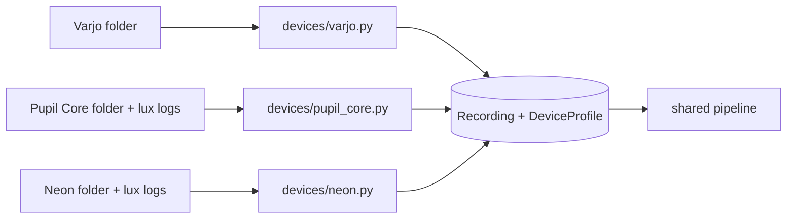

# Devices

Each device has a reader in `cwtool/devices/` that turns a recording folder into the same device-independent
`Recording`. Everything after that, from the video analysis to ΔPD, is shared.



## Detection

`devices.detect(folder)` asks each reader in turn whether it recognises the folder:

| Device | Recognised by |
|---|---|
| `varjo` | a file whose name contains `varjo_gaze_output_` |
| `pupil_core` | `info.player.json` and an `exports/<n>/pupil_positions.csv` |
| `pupil_neon` | `info.json` with `3d_eye_states.csv` or `gaze.csv` (Cloud export), or `gaze ps*.raw` / `gaze_200hz.raw` / `eye_state ps*.raw` (native) |

Pass `--device` (or `device=` to `devices.load`) to skip detection.

## Comparison

| | Varjo XR-4 | Pupil Core | Pupil Neon |
|---|---|---|---|
| Pupil | mm, reported radius (×2) | mm (3D model) or px (2D) | mm per eye |
| Sampling | 200 Hz | 120/200 Hz per eye | 200 Hz |
| Invalid samples | tracking status | confidence < 0.6 | not worn, blinks (Cloud) |
| Gaze | projected to the left-eye view | normalised scene coordinates | scene camera pixels |
| Scene video | capture of the left-eye view, circular | world camera | scene camera, 1600×1200 |
| Frame timing | constant frame rate | recorded timestamps | recorded timestamps |
| Luminance | display photometry | lux sensor + video | lux sensor + video |
| Adapting field | display field of view | binocular visual field | binocular visual field |
| Events | `event_log` CSV | `event_log` CSV | recording/Cloud events + `event_log` CSV |

## The Recording

Defined in `cwtool/recording.py`. All arrays share one time base.

| Field | Content |
|---|---|
| `time` | s, relative to the first scene video frame (can start below 0) |
| `epoch_start` | Unix time (s) of `time == 0`, used to find lux readings and write absolute timestamps |
| `pupil_left`, `pupil_right` | pupil size in the device's unit; NaN where invalid |
| `gaze` | (N, 2) normalised scene video coordinates, origin at the top left; NaN where invalid |
| `scene_video` | path of the scene video |
| `scene_frame_times` | recorded time of each frame (s, same clock), or None for a constant frame rate |
| `lux_time`, `lux_values` | lux sensor readings on the same clock, for lux devices |
| `events` | list of `Event(label, start, end)` |
| `profile` | the `DeviceProfile` |

## The DeviceProfile

What the analysis needs to know about a device, as opposed to a participant:

| Field | Use |
|---|---|
| `pupil_unit`, `pupil_scale` | device units × scale = mm; `None` for pixels (scaled per recording) |
| `luminance_source` | `display` (display photometry) or `lux_sensor` |
| `field_of_view` | deg (h, v) spanned by the scene video: converts the gaze circle radius to pixels |
| `circular_scene` | the scene video is a circle with black corners that must be masked out (Varjo) |
| `native_rate` | Hz, used when `analysis_rate` is 0 |
| `adapting_field` | deg (h, v) the eye adapts to, if larger than the video; its area enters Watson & Yellott |

Because each device supplies its own field area and pupil scale, the photometric parameters are real luminances
and parameter files are device-independent.

## Adding a device

Write a module in `cwtool/devices/` with:

```python
NAME = "my_tracker"

def detect(folder: Path) -> bool: ...

def load(folder: Path, **options) -> Recording: ...
```

and add it to `READERS` in `cwtool/devices/__init__.py`. `devices.load` passes only the options the reader's
`load` accepts (e.g. `lux_folder`), so readers can take their own. Helpers in `devices/common.py` cover binning
irregular samples onto a grid, estimating the sampling rate, the field of view from a camera matrix, reading event
logs and turning point markers into events. Add a synthetic recording writer to `tests/conftest.py` and tests like
`tests/test_neon.py`.
