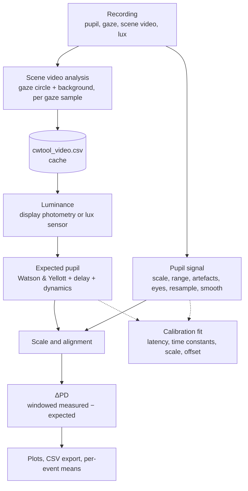

# Pipeline overview

The analysis runs in two passes with very different costs:

1. **Video pass** (`cwtool/video.py`), seconds to minutes: decodes the scene video and measures, for every valid gaze
   sample, the colour inside a circle around the gaze point and over the background. Colours are stored for a grid
   of gamma values, so nothing in the second pass needs the video again. The result is cached next to the
   recording.
2. **Signal pass** (`cwtool/pipeline.py`), a fraction of a second: everything else. It re-runs on every parameter
   change, which is what makes the app's plots live.

## Steps and where to read about them

| Step | Module | Page |
|---|---|---|
| Read the device's files into a `Recording` | `devices/` | [Devices](../devices/index.md) |
| Measure gaze circle and background colours | `video.py` | [Scene video analysis](video.md) |
| Turn colours into cd/m² | `luminance.py`, `lux.py`, `pipeline.prepare` | [Luminance](luminance.md) |
| Clean and resample the pupil | `pipeline.prepare` | [Pupil signal](pupil-signal.md) |
| Expected pupil for that luminance | `model.py`, `pipeline.expected_pupil` | [Expected pupil model](model.md) |
| Offset, ΔPD, statistics, events | `pipeline.run` | [ΔPD and alignment](delta-pd.md) |
| Participant parameters from the calibration sequence | `fit.py`, `calibration.py` | [Calibration fit](calibration-fit.md) |

## Clocks

Everything runs on the recording's relative clock: seconds from the first scene video frame. Lux readings are moved
onto it with `epoch_start`, and the **time lag** parameter shifts the luminance signal (video and lux) to correct a
known offset. Exports carry both the relative and the Unix time.
