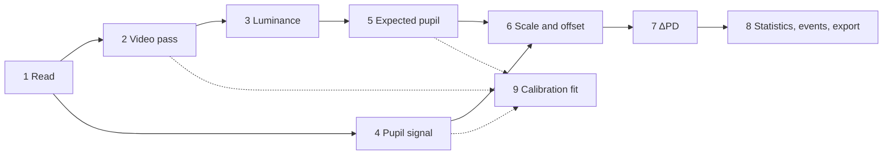

# Processing at a glance

Every step from a recording folder to the exported ΔPD, in the order the code runs it. For each step: what it does,
the parameters and defaults that control it, and the function that does it. The linked pages give the reasoning and
the equations. The defaults are those of `Parameters()` and `VideoSettings()` in `cwtool/params.py`; all parameters
are listed in [Parameters](../reference/parameters.md).

Steps 1 and 2 run once per recording (the video pass is cached). Steps 3–8 are the **signal pass**, `pipeline.run`,
which re-runs on every parameter change. Step 9 runs on demand and writes its results into the parameters.

## 1. Read the recording

`devices.load(folder, device=None, **options)` → `Recording` ([Devices](../devices/index.md))

| | |
|---|---|
| Detection | each reader's `detect(folder)` in turn: Varjo, Pupil Core, Pupil Neon, Tobii Pro Glasses 3 |
| Pupil | per eye, in device units; NaN where invalid |
| Validity | Varjo: tracking status 1 or lower (overall or either eye); Core: confidence below 0.6; Neon: not worn, and 0.1 s around Cloud blinks; Glasses 3: empty samples. Zero or negative diameters are invalid on every device |
| Grid | irregular samples are averaged into bins at the measured rate (`common.bin_samples`, `common.sample_rate`) |
| Time base | seconds from the first scene video frame (can start below 0); `epoch_start` is its Unix time |
| Gaze | normalised scene video coordinates, origin top left |
| Lux | the lux logs in the recording, its `lux` subfolder or `--lux`/**Choose lux folder** (`lux.find_lux_folder`, `lux.read_lux`), moved onto the recording clock with `epoch_start` |
| Events | `event_log` CSV (`common.read_event_log`) plus Neon and Glasses 3 recording events (`common.events_from_markers`) |
| Profile | pupil unit and scale, luminance source (`display` or `lux_sensor`), camera field of view, circular scene, native rate, adapting field, `experimental` |

Neon and Glasses 3 readers are **experimental**: every result from them carries a warning (step 8).

## 2. Scene video pass

`video.analyse_video(...)` → `VideoResult`, cached as `cwtool_video.csv` + `.json` ([Scene video analysis](video.md))

| Step | Settings | Code |
|---|---|---|
| Match each valid gaze sample to its frame: nearest recorded timestamp (Core, Neon) or constant frame rate (Varjo, Glasses 3) | – | `FrameClock` |
| Decode (PyAV, else OpenCV) in parallel chunks of at least 150 frames; only frames with gaze are converted | `--workers` (default one per core) | `_frames_pyav`, `_frames_opencv` |
| Downscale with nearest-neighbour sampling, convert to RGB | `analysis_width` 500 px | `prepare_frame` |
| Gaze circle: disc of the given radius at the gaze point | `fixation_radius_deg` 5.25° (radius = degrees / vertical field of view × height) | `radii`, `analyse_frame` |
| Background: whole frame, or a centred circle on circular (Varjo) videos; minus the gaze circle | `field_radius` 0.8, `background_excludes_fixation` on | `field_mask` |
| Per area and channel: 256-bin histogram → mean code value and mean of \((C/255)^\gamma\) for γ = 1.4, 1.6 … 3.0 (gaze circle, background, whole visible scene) | – | `_histograms`, `_means` |
| Cache, reused only if format, γ grid, settings, video name, frame clock and gaze all match | – | `VideoResult.save`, `load_cached` |

## 3. Luminance \(L(t)\), cd/m²

`pipeline.prepare` ([Luminance](luminance.md))

**3a. Linear colour at the current gamma.** The stored linear means are interpolated to `gamma` (default 2.2) in log
space (`video.at_gamma`), and the two areas weighted: \(\mathbf{C}_w = w\,\mathbf{C}_\text{gaze} + (1-w)\,\mathbf{C}_\text{background}\),
`fixation_weight` \(w\) = 0.65 (`VideoResult.weighted`).

**3b. One of four methods**, chosen from the device and the data (reported as `Result.luminance_mode`):

| Mode | When | Luminance | Parameters | Code |
|---|---|---|---|---|
| display | display devices (Varjo) | \(\sum_c k_c\,(L_\text{max}\,\tfrac{g_c}{\bar g}\,C_{w,c} + L_\text{min}(1-C_{w,c}))\), \(k\) = BT.709 weights | `l_min` 0.02, `l_max` 70 cd/m², `gamma` 2.2 (display photometry file); `gain_r/g/b` 1 (participant) | `scene_luminance`, `luminance.absolute_luminance` |
| lux sensor | glasses with a lux log | \(\bar L \cdot Y_w / Y_\text{frame}\), \(\bar L = (g\,E + o)/\Omega\) from the smoothed lux \(E\) (Savitzky–Golay 11, order 6) | `lux_gain` 1, `lux_offset` 0, `lux_solid_angle` 2.2, `lux_use_video` on (off: \(\bar L\) alone) | `luminance_from_lux`, `relative_luminances`, `lux.smooth`, `lux.average_luminance` |
| camera, fixed exposure | glasses without a lux log, `camera_exposure` = fixed | \(L_\text{white}\,\tfrac{t_\text{ref}}{t}\,Y_w\); warning if the gaze area is saturated in more than 5 % of samples | `camera_white` 1000 cd/m², `camera_reference_ms` 0, `camera_exposure_ms` 0 | `relative_luminances`, `Parameters.camera_full_scale`, `clipped_fraction` |
| camera, relative | glasses without a lux log, `camera_exposure` = auto | as display, with a warning that it is only relative | `l_min`, `l_max`, `gamma` | `scene_luminance` |

\(Y\) is the relative luminance with the BT.709 weights and the channel balance \(g_c/\bar g\).

**3c. Time.** Video and lux luminance are interpolated onto the analysis grid (step 4), with their timestamps shifted
by `timelag` (0 s).

## 4. Pupil signal

`pipeline.prepare` ([Pupil signal](pupil-signal.md))

| # | Step | Parameters | Code |
|---|---|---|---|
| 4.1 | Scale to mm: device units × profile `pupil_scale` × `pupil_correction`. Pixel data have no scale yet (step 6) | `pupil_correction` 1 | `prepare` |
| 4.2 | Range: diameters outside 1–9 mm removed, per eye (skipped for pixel data) | `PUPIL_RANGE_MM` | `prepare` |
| 4.3 | Artefacts: speed above the limit towards a sample at least 40 ms away, widened by the padding, per eye (skipped for pixel data) | `max_pupil_speed` 10 mm/s (0 = off), `artefact_padding` 0.05 s | `artefacts` |
| 4.4 | Combine the eyes; `both` averages, falling back to one eye | `eye` both | `combine_eyes` |
| 4.5 | Resample onto a uniform grid by linear interpolation; gaps longer than `max_gap` marked invalid | `analysis_rate` 100 Hz (0 = native), `max_gap` 0.5 s | `resample` |
| 4.6 | Smooth: Savitzky–Golay order 2 over about 0.5 s (**measured**) and order 6 over about 0.25 s, at least 9 samples (**measured raw**, used by the calibration fits); both NaN in long gaps | – | `prepare` |

## 5. Expected pupil

`pipeline.expected_pupil` ([Expected pupil model](model.md))

| # | Step | Parameters | Code |
|---|---|---|---|
| 5.1 | Light sensitivity: \(s \cdot L\) | `sensitivity` 1 | `steady_pupil` |
| 5.2 | Watson & Yellott: flux = \(sL\) × adapting field area (profile, deg²) × 1 (two eyes) or 0.1 (one); Stanley & Davies diameter; age correction against 28.58 years | `age` 25, `eyes` 2 | `model.watson_yellott` |
| 5.3 | Latency: shift right | `delay` 0.5 s | `model.delay` |
| 5.4 | Dynamics switch: 5.5–5.6 only when on | `dynamics` on | `dynamic_pupil` |
| 5.5 | Attack/release filter: one pole, τ = `attack` while the expected diameter rises, `release` while it falls; with 2 stages a second `release` stage acts during constriction only (S-shaped onset) | `attack` 6 s, `release` 0.5 s, `constriction_stages` 2 | `model.attack_release` |
| 5.6 | Transient (pupillary escape): minus `transient` × \(h/(h+0.2)\), \(h\) = rise of log₁₀ L over its low-pass with τ = `escape`; delayed and passed through one low-pass (τ = `release`) per constriction stage | `transient` 0 mm (off), `escape` 2 s | `model.escape_transient`, `model.lowpass` |

## 6. Pupil scale and offset

`pipeline.run`, `pipeline.alignment_offset` ([ΔPD and alignment](delta-pd.md))

| Step | Parameters |
|---|---|
| Pixel data: scale so that mean measured = mean expected, then × `pupil_correction` | `pupil_correction` 1 |
| Offset added to the measured pupil: `recording` median(expected − measured) over valid samples; `baseline` the same over the named events (whole recording, with a warning, if none); `fixed` `pupil_offset`; `none` 0 | `alignment` recording, `baseline_events` "Riposo, Rest, Baseline", `pupil_offset` 0 mm |
| Plausibility: warning if the median measured pupil, after the offset, is outside 2–8 mm | – |

## 7. ΔPD

`pipeline.run`, `pipeline.windowed_difference`

1. Measured − expected, averaged over consecutive windows of `cw_window` (0.2 s), ignoring invalid samples; windows
   without any stay NaN.
2. Smoothed with a Savitzky–Golay filter of order 1 over `cw_smoothing` (1) windows on each side; gaps stay NaN.

## 8. Statistics, events, export

| Output | Definition | Code |
|---|---|---|
| ΔPD RMS | root mean square of ΔPD about zero | `residual_rms` |
| ΔPD SD | standard deviation of ΔPD; ΔPD / SD is exported as the normalised ΔPD | `run` |
| Gap fraction | share of the grid in gaps longer than `max_gap` | `run` |
| Black and white point | expected pupil at `l_min` and `l_max` (display and relative camera modes only) | `run` |
| Warnings | experimental reader, missing lux data, saturation, baseline events not found, implausible pupil | `prepare`, `run` |
| Event means | mean ΔPD (mm and SD units) inside each event | `event_means` |
| Files | `<name>_pupil.csv`, `<name>_cw.csv`, `<name>_events.csv`, `<name>_params.json` (+ `<name>_plot.pdf`) | `export`, `plot.plot_result` |

See [Output files](../reference/outputs.md) for the columns.

## 9. Participant calibration (Varjo)

Run on the participant's calibration sequence, in this order ([Calibration fit](calibration-fit.md),
[Participant calibration](../usage/calibration.md)). The display photometry is taken as given throughout.

| # | Step | Details | Code |
|---|---|---|---|
| 9.1 | Locate the sequence | change points (> 8 code values, ≥ 0.3 s apart) in the gaze circle colour; candidate starts scored by the relative RMS colour error in linear light with one gain per channel, skipping 0.5 s after each change; step length rescaled if the recording's steps differ; at least half of the window must have analysed video. The app rejects matches with an error above 35 % | `calibration.locate` |
| 9.2 | Light response | level per step = mean of the measured raw pupil over its last 30 % (after `delay` + 0.1 s), colour = mean weighted linear colour after 0.5 s; weighted least squares of measured ≈ c · WY(s · L(gains, γ)) + d over log s, log gains, log c, d (optionally γ), weak priors on gains (SD 1.5 in log), c (0.25) and γ (0.2), none on s; five starting sensitivities. Sets `sensitivity`, `gain_r/g/b` (mean 1), `pupil_correction` × 1/c, `pupil_offset` −d/c | `photometry.fit_light_response` |
| 9.3 | Latency | median constriction onset at brightening steps (20–50 % line back to the pre-change level; constrictions ≥ 0.3 mm; onsets < 0.1 s excluded; at least 3), minus the onset bias of the model's constriction shape for each candidate τ. Otherwise fitted | `fit.onset_latency`, `fit.latency_from_onset` |
| 9.4 | Dynamics, scale, offset | Nelder–Mead over log `attack` (0.3–30 s), log `release` (0.05–5 s) and optionally (the app: whenever it fits the dynamics) log `transient` (0.01–3 mm) and log `escape` (0.3–30 s); a transient at its lower limit is set to 0; for each candidate, measured ≈ c · expected + d by least squares over the window with 30 s of pre-roll; if the scale falls outside ×0.5–2 or the pupil barely moves (SD < 0.05 mm), only the offset is fitted. Sets `alignment` = fixed | `fit.fit_calibration` |

Glasses without a calibration sequence can still use a camera calibration:
`pipeline.calibrate_camera` sets `camera_white` from a fixed-exposure recording with a lux log (median of
\(\bar L / Y_\text{frame}\) over samples that are neither black nor saturated; a warning above ×2 spread).
